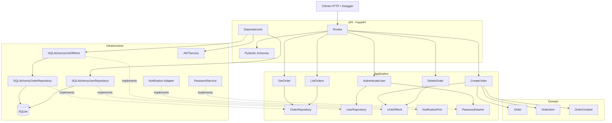

# Diagrama de arquitectura

El proyecto utiliza principios de Arquitectura Hexagonal y Arquitectura Limpia.

```mermaid
flowchart TD
    Client[Cliente HTTP / Swagger]

    subgraph API["API - FastAPI"]
        Routes[Routes]
        Schemas[Pydantic Schemas]
        Dependencies[Dependencies]
    end

    subgraph Application["Application"]
        Create[CreateOrder]
        Get[GetOrder]
        List[ListOrders]
        Delete[DeleteOrder]
        Auth[AuthenticateUser]

        RepoPort[OrderRepository]
        UserPort[UserRepository]
        UOWPort[UnitOfWork]
        NotificationPort[NotificationPort]
        PasswordPort[PasswordHasher]
    end

    subgraph Domain["Domain"]
        Order[Order]
        Item[OrderItem]
        Event[OrderCreated]
    end

    subgraph Infrastructure["Infrastructure"]
        SQLRepo[SQLAlchemyOrderRepository]
        UserRepo[SQLAlchemyUserRepository]
        SQLUOW[SQLAlchemyUnitOfWork]
        JWT[JWTService]
        Password[PasswordService]
        Notification[Notification Adapter]
        DB[(SQLite)]
    end

    Client --> Routes
    Routes --> Schemas
    Routes --> Create
    Routes --> Get
    Routes --> List
    Routes --> Delete
    Routes --> Auth

    Create --> Order
    Create --> Item
    Create --> Event

    Create --> UOWPort
    Get --> RepoPort
    List --> RepoPort
    Delete --> UOWPort
    Auth --> UserPort
    Auth --> PasswordPort

    SQLRepo -. implements .-> RepoPort
    UserRepo -. implements .-> UserPort
    SQLUOW -. implements .-> UOWPort
    Password -. implements .-> PasswordPort
    Notification -. implements .-> NotificationPort

    SQLUOW --> SQLRepo
    SQLRepo --> DB
    UserRepo --> DB

    Dependencies --> SQLUOW
    Dependencies --> UserRepo
    Dependencies --> JWT
```