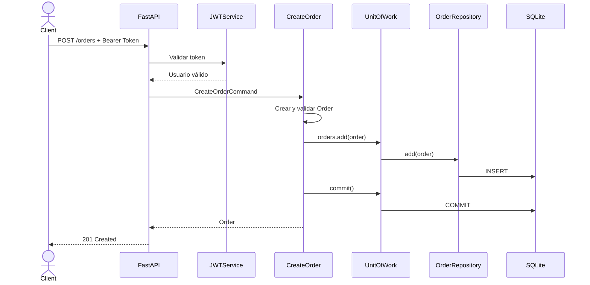

# Flujo de una petición

Ejemplo de creación de una orden autenticada.

```mermaid
sequenceDiagram
    actor Client
    participant API as FastAPI
    participant JWT as JWTService
    participant UC as CreateOrder
    participant UOW as UnitOfWork
    participant Repo as OrderRepository
    participant DB as SQLite

    Client->>API: POST /orders + Bearer Token
    API->>JWT: Validar token
    JWT-->>API: Usuario válido

    API->>UC: CreateOrderCommand
    UC->>UC: Crear y validar Order

    UC->>UOW: orders.add(order)
    UOW->>Repo: add(order)
    Repo->>DB: INSERT

    UC->>UOW: commit()
    UOW->>DB: COMMIT

    UC-->>API: Order
    API-->>Client: 201 Created
```